##Introduction
Compare [O2] to FRRf data.

##ToDo
Read in Optode Data
Read in FRRf Data
Fit slopes to O2data over time windows defined by FRRf changes in PAR
Compare O2 slopes to FRR ETR estimates


# Set Chunk Options


```r
#"..", takes up a level in the directory path
Project <- "FluorO2"
DataInO2 <- file.path("..","ImportData", "Optode")
DataInFRRf <- file.path("..","ImportData", "FRRf")
DataOut <- file.path("..", "FitData")
#MetaCatalog <- file.path("..","PicoCatalog.csv")
```


```r
# libraries; Note check actual dependencies
library(tidyverse)
library(lubridate)
library(stringr)
library(broom)
library(knitr)
#library(zoo)
library(tidyquant)
library(googlesheets4)
library(googledrive)
#library(dplyr)
```


```r
Wavelengths_nm = c(445, 470, 505, 535, 590)
Colours_nm = c("darkblue", "dodgerblue", "darkgreen", "yellowgreen",  "darkorange")


names(Colours_nm) <- Wavelengths_nm
Colours_nm
```

```
##           445           470           505           535           590 
##    "darkblue"  "dodgerblue"   "darkgreen" "yellowgreen"  "darkorange"
```

This chunk reads in the MetaData catalog from googlesheets 

```r
# gs4_deauth()
# #deauthorizes access to googlesheet
# 
# MetaCatalog <- read_sheet("https://docs.google.com/spreadsheets/d/1ZXpwR7Gfto-uRzVdXzMpQF4frbrvMLH_IyLqonFZRSw/edit#gid=0") %>%
# # sheet is read in by sheet ID, obtained from the URL of the sheet.
# # read_sheet has an annoying "feature" to set the type of columns it can't parse to a list.
# # ggplot/dplyr doesn't like working with a dataframe of lists.
# # In this case WL is set to a list since some values are numbers, some are strings, some are blank.
# # To fix this, first drop all rows missing WL, then unlist.
# # Must first drop NA rows since unlist will collapse NULL lists, then the unlisted WL is a shorter length than original WL column, which mutate doesn't like.
# 
# drop_na(WL) %>%
#   mutate(WL = unlist(WL))
# 
# as.data.frame(MetaCatalog)
```

Tidy the catalog, making dates as date values, tube as character, and wavelenth as a character

```r
# TidyCatalog <- MetaCatalog %>%
#   mutate(InnocDate = ymd(InnocDate),
#          ExpDate = ymd(ExpDate), 
#          Tube = as.character(Tube)) %>% 
#   select(-c(PrimaryOperator, Description, Motivation, doi, Source, SourceSalinity, Plate, Well))
# 
# #Catalog <- MetaCatalog %>%
#   #mutate(InnocDate = ymd(InnocDate),
#          #ExpDate = ymd(ExpDate),
#          #Tube = as.character(Tube)) %>%
#   #select(-c(PrimaryOperator, Description, Motivation, doi))
# 
# #check catalog for correct selections
# 
#   TidyCatalog
```


Read in O2Data and FRRfData
Make this more general as we accumulate more files.

```r
O2Data <- readRDS(file = file.path(DataInO2, "FluorO2_O2Data.Rds"))
FRRfData <- readRDS(file = file.path(DataInFRRf, "FluorO2_SolFitsTrim.Rds"))
```

Remove missing rows, reconcile time formats

```r
O2Data <- O2Data %>%
  filter(!is.na(LR_s)) %>%
  mutate(Date = dmy(Date),
         AbsTime = as.period(AbsTime))

FRRfData <- FRRfData %>%
  filter(!is.na(LR_s))
```


```r
O2Data %>%
  ggplot() +
  geom_point(aes(x = LR_s, y = O2_umolL, colour = Ex_WL)) +
  #geom_point(aes(x = FRRfData$LR_s, y = FRRfData$JVPSII_aLHIIminmax)) +
  scale_colour_manual(values = Colours_nm) +
  facet_grid(rows = vars(Ex_WL), cols = vars(CultureID)) +
  theme_bw()
```

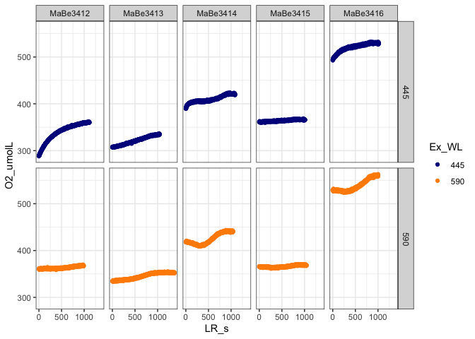<!-- -->

```r
FRRfData %>%
  filter(Dark1s == 0) %>%
  ggplot() +
  geom_point(aes(x = LR_s, y = JVPSII_aLHIIminmax)) +
  #geom_point(aes(x = O2Data$LR_s, y = O2Data$O2_umolL, colour = Ex_WL)) +
  scale_colour_manual(values = Colours_nm) +
  facet_grid(rows = vars(Ex_WL), cols = vars(CultureID)) +
  theme_bw()
```

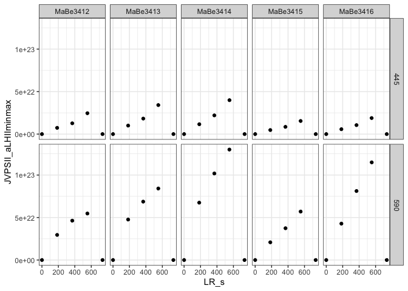<!-- -->

#Try Simple left_join, in case times line up


```r
O2FRRfData <- left_join(x = O2Data, y = FRRfData, by = c(c("Date" = "ObsDate"), c("AbsTime" = "ObsTime"), "CultureID", "Ex_WL"), suffix = c("O2", "FRRf"), keep = FALSE)
```


```r
O2FRRfData %>%
  ggplot() +
  geom_point(aes(x = LR_sO2, y = O2_umolL, colour = Ex_WL)) +
  geom_point(aes(x = LR_sFRRf, y = JVPSII_aLHIIminmax)) +
  scale_colour_manual(values = Colours_nm) +
  facet_grid(rows = vars(Ex_WL), cols = vars(CultureID)) +
  theme_bw()
```

```
## Warning: Removed 10637 rows containing missing values (geom_point).
```

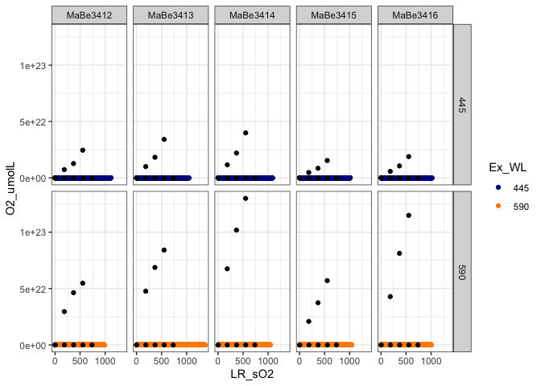<!-- -->

```r
O2FRRfData %>%
  ggplot() +
  geom_point(aes(x = JVPSII_aLHIIminmax/1e20, y = O2_umolL,colour = Ex_WL)) +
  scale_colour_manual(values = Colours_nm) +
  facet_grid(rows = vars(Ex_WL), cols = vars(CultureID)) +
  theme_bw()
```

```
## Warning: Removed 10637 rows containing missing values (geom_point).
```

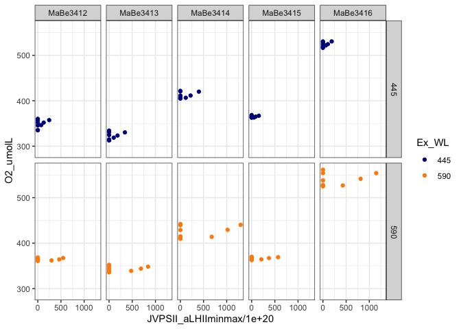<!-- -->

Interpolate FRRf and ActPAR estimates across entire time axis

```r
#http://publish.illinois.edu/spencer-guerrero/2014/12/11/2-dealing-with-missing-data-in-r-omit-approx-or-spline-part-1/
#https://dplyr.tidyverse.org/dev/articles/colwise.html
#Interpolation causes problems with final rows that repeat last value.

interpolate <- function(x){zoo::na.locf(x, na.rm = FALSE, fromLast = TRUE, type = "l", maxgap = Inf)}

O2FRRfData <- O2FRRfData %>%
  mutate(Fointer = interpolate(Fo),
         Fminter = interpolate(Fm),
         Siginter = interpolate(Sig),
         Dark1sinter = interpolate(Dark1s),
         LR_sFRRfinter = interpolate(LR_sFRRf),
         ActPARinter = interpolate(ActPAR),
         ActPAR_photonsm2sinter = interpolate(ActPAR_photonsm2s),
         JVPSIIinter = interpolate(JVPSII_aLHIIminmax))
```


```r
O2FRRfData %>%
  ggplot() +
  geom_point(aes(x = ActPAR_photonsm2sinter, y = JVPSIIinter/1e20), colour = "green") +
  geom_point(aes(x = ActPAR_photonsm2sinter, y = O2_umolL), colour = "red") +
  scale_colour_manual(values = Colours_nm) +
  facet_grid(rows = vars(Ex_WL), cols = vars(CultureID)) +
  theme_bw()
```

```
## Warning: Removed 66 rows containing missing values (geom_point).

## Warning: Removed 66 rows containing missing values (geom_point).
```

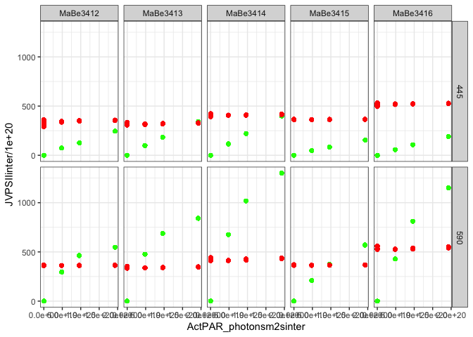<!-- -->

```r
O2FRRfData %>%
  ggplot() +
  geom_point(aes(x = LR_sO2, y = JVPSIIinter/1e20, colour = Ex_WL)) +
  geom_point(aes(x = LR_sO2, y = O2_umolL, colour = Ex_WL)) +
  scale_colour_manual(values = Colours_nm) +
  facet_grid(rows = vars(Ex_WL), cols = vars(CultureID)) +
  theme_bw()
```

```
## Warning: Removed 66 rows containing missing values (geom_point).
```

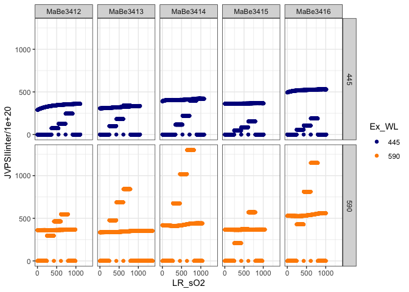<!-- -->

Estimate O2 slopes over LR PAR step ranges
Be careful with nesting!  Multiple steps at single ActPARinter

```r
O2FRRfNest <- O2FRRfData %>%
  filter(Dark1sinter == 0) %>%
  nest(data = -c(Date, CultureID, Ex_WL, LR_sFRRfinter, ActPARinter, JVPSIIinter)) %>%
  mutate(O2lm = map(data,  possibly(~ lm(O2_umolL ~ as.numeric(AbsTime), data = .x), otherwise = NULL)),
         O2lm_tidy = map(O2lm, possibly(tidy, otherwise = NULL))) %>%
  select(-c(data, O2lm)) %>%
  unnest(cols = O2lm_tidy) %>%
  filter(term  != "(Intercept)") %>%
  select(-term) %>%
  rename(O2_umolmls = estimate) %>%
  group_by(Date, CultureID, Ex_WL) %>% #careful with group_by; this only works with a single replication of each LR
  mutate(O2evln_O2ls = (O2_umolmls - (mean(O2_umolmls[1],O2_umolmls[5])))*6.022e17) %>%
  ungroup()

#
```


```r
O2FRRfNest %>%
  ggplot() +
  geom_line(aes(x = LR_sFRRfinter, y = O2_umolmls, colour = Ex_WL)) +
    scale_colour_manual(values = Colours_nm) +
    facet_grid(cols = vars(CultureID), rows = vars(Ex_WL)) +
    theme_bw()
```

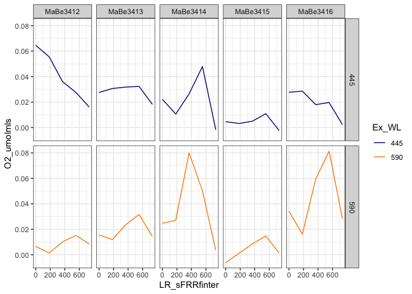<!-- -->

```r
O2FRRfNest %>%
  ggplot() +
  geom_line(aes(x = ActPARinter, y = O2_umolmls, colour = Ex_WL)) +
    scale_colour_manual(values = Colours_nm) +
    facet_grid(cols = vars(CultureID), rows = vars(Ex_WL)) +
    theme_bw()
```

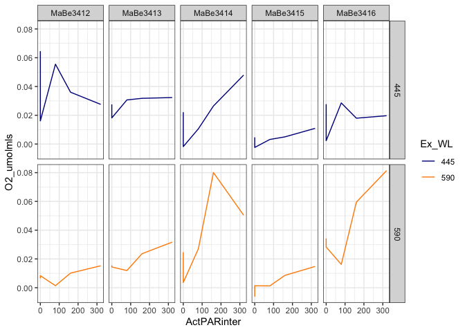<!-- -->

```r
O2FRRfNest %>%
  ggplot() +
  geom_line(aes(y = JVPSIIinter, x = O2evln_O2ls, colour = Ex_WL)) +
    scale_colour_manual(values = Colours_nm) +
    facet_grid(cols = vars(CultureID), rows = vars(Ex_WL)) +
    theme_bw()
```

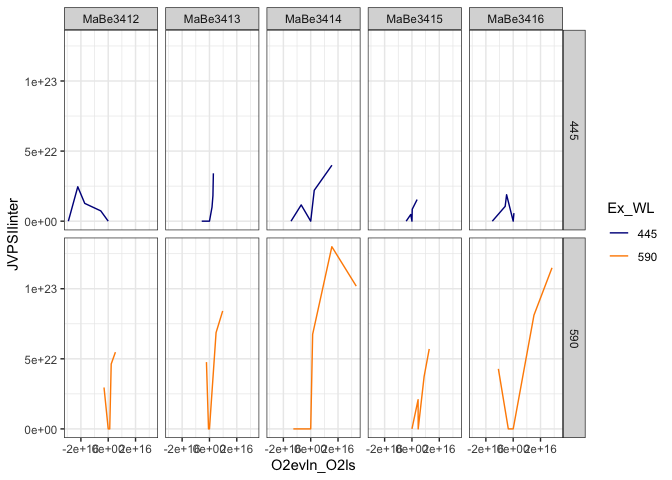<!-- -->

```r
O2FRRfNest %>%
  ggplot() +
  geom_point(aes(y = JVPSIIinter, x = O2evln_O2ls, colour = Ex_WL)) +
    scale_colour_manual(values = Colours_nm) +
    #facet_grid(cols = vars(CultureID), rows = vars(Ex_WL)) +
    theme_bw()
```

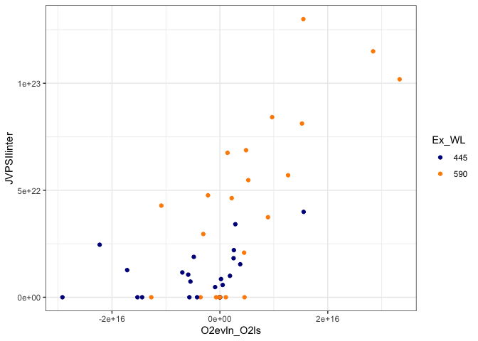<!-- -->

```r
O2FRRfNest %>%
  ggplot() +
  geom_point(aes(x = JVPSIIinter, y = O2evln_O2ls, colour = Ex_WL)) +
    scale_colour_manual(values = Colours_nm) +
    #facet_grid(cols = vars(CultureID), rows = vars(Ex_WL)) +
    theme_bw()
```

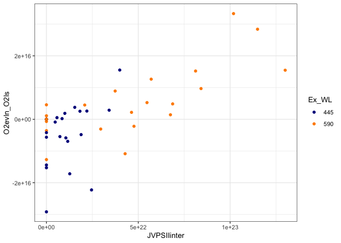<!-- -->


```r
saveRDS(O2FRRfData, file.path(DataOut, paste(Project, "O2Data.Rds", sep = "_"), fsep = .Platform$file.sep))
```


